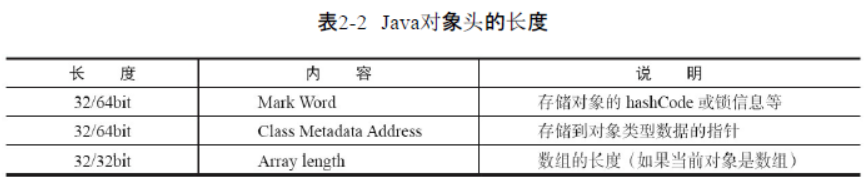

## 一、volatile

1.轻量级synchronized，保证**可见性**（一个线程修改一个共享变量时，另外一个线程能读到这个修改的值。）

2.volatile的两条实现原则：

​	1）Lock前缀指令会引起处理器缓存回写到内存

​	2）一个处理器的缓存回写到内存会导致其他处理器的缓存无效

## 二、synchronized

1.对于普通同步方法，锁是当前实例对象。

```java
public class B{
    public static void main(String args){
        A a = new A();
        a.synMethod();
    } 
}
//多线程调用a.synMethod()时，需要获取a的锁
```

2.对于静态同步方法，锁是当前类的Class对象

```java
public class A{
    public static synchronized void synMethod(){
        ...
    }
}
//多线程调用A.synMethod()时，需要获取Class A的锁
```

3.对于同步方法块，锁是Synchonized括号里配置的对象

```java
synchronized（obj）{
	//同步代码块
}
//多线程执行代码块时需要获得obj锁
```

## 三、Java对象头



## 四、锁升级与对比

### 1.偏向锁：

​		1）在对象头和栈帧中的锁记录里存储锁偏向的线程ID，被记录的线程进入同步块不需要加锁解锁。

​		2）偏向锁的撤销，需要等待全局安全点；检查记录线程是否存活，改写mark word为无锁或者其他线程ID。

### 2.轻量级锁：

​		1）加锁：创建用于存储锁记录的空间，并将对象头中的Mark Word复制到锁记录中，尝试使用CAS将对象头中的Mark Word替换为指向锁记录的指针，有竞争就自旋获取。

​		2）解锁：CAS操作将Displaced Mark Word替换回到对象头，有竞争力膨胀成重量级锁。

### 3.重量级锁：

​		不用自旋等待锁释放，等待通知即可

### 4.锁优缺点比较：


## 五、原子操作

### 1.实现方式：

​		1）总线锁保证原子性（一个处理器独占内存资源）

​		2）缓存锁定来保证原子性（锁定缓存行，使其他缓存行失效）

### 2.CAS实现原子操作的三大问题：

​		1）ABA问题（增加版本号或AtomicStampedReference解决）

​		2）循环时间长开销大

​		3）只能保证一个共享变量的原子操作

## 六、java内存模型

### 1.线程间通信


### 2.happens-before：

1）程序顺序规则：一个线程中的每个操作，happens-before于该线程中的任意后续操作。

2）监视器锁规则：对一个锁的解锁，happens-before于随后对这个锁的加锁。

3）volatile变量规则：对一个volatile域的写，happens-before于任意后续对这个volatile域的读。

4）传递性：如果A happens-before B，且B happens-before C，那么A happens-before C。

### 3.as-if-serial语义：

​		不管怎么重排序（编译器和处理器为了提高并行度），（单线程）程序的执行结果不能被改变。

### 4.顺序一致性：

​		1）一个线程中的所有操作必须按照程序的顺序来执行。

​		2）（不管程序是否同步）所有线程都只能看到一个单一的操作执行顺序。在顺序一致性内
存模型中，每个操作都必须原子执行且立刻对所有线程可见。

### 5.线程间通信：

​		1）A线程写volatile变量，随后B线程读这个volatile变量。

​		2）A线程写volatile变量，随后B线程用CAS更新这个volatile变量。

​		3）A线程用CAS更新一个volatile变量，随后B线程用CAS更新这个volatile变量。

​		4）A线程用CAS更新一个volatile变量，随后B线程读这个volatile变量。

### 6.final域重排序：

​		1）在构造函数内对一个final域的写入，与随后把这个被构造对象的引用赋值给一个引用变量，这两个操作之间不能重排序。（**final域必须构造好才能够被引用**）
​		2）初次读一个包含final域的对象的引用，与随后初次读这个final域，这两个操作之间不能重排序。（**必须先获得对象引用，才能获得对象的final域**）

